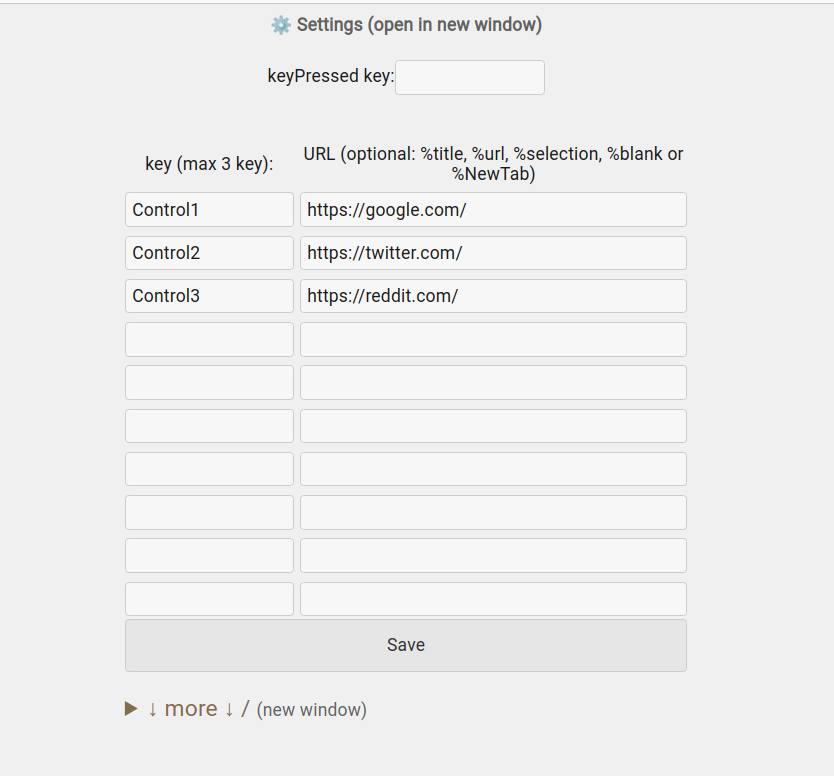

README.md  

About:  

Assign keys to a specific website.  
When you press the assigned Key and URL that is set in the setting, it's opening in the current or new tab (if you input a specific parameter).  

Notice:
· Addon tries to stop working when entering text.  

Screenshots:  

