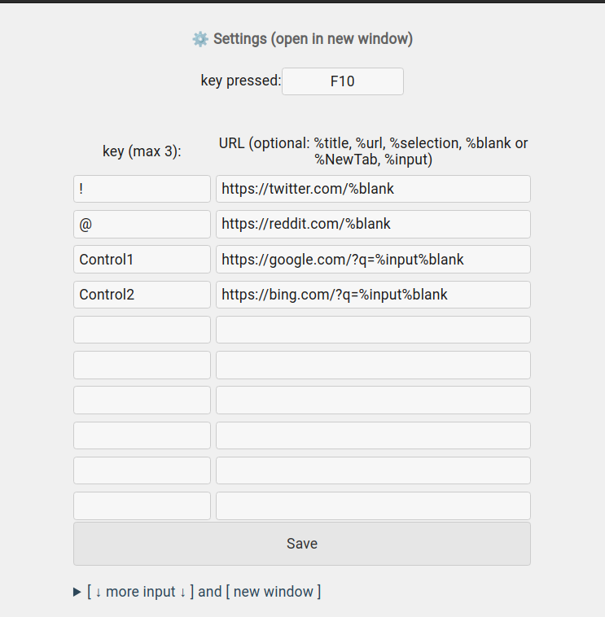

README.md

About:  

Assign keys to a specific website.  
When you press the assigned key that is specified in the settings, the site assigned to this key opens in the current tab (via redirect)

Screenshots:

