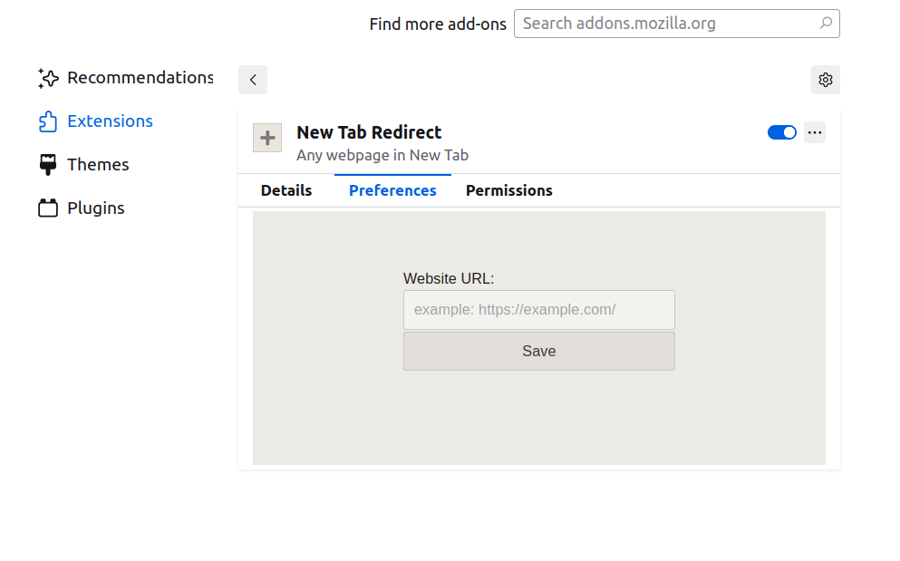

README.md

About:
Your own URL website will open in a New Tab.

You need to enter your website URL address in the addon options, then this address will be opened every time when you press the "+" button for create New Tab (or Ctrl+T)

Notice:
How it works: when you open a new tab, the extension creates a new tab with your website address and closes the current one (redirect)

Screenshots:

