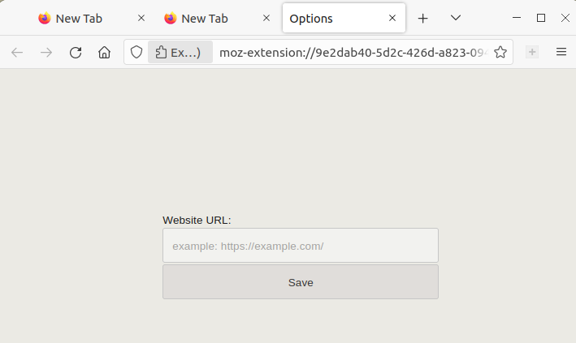
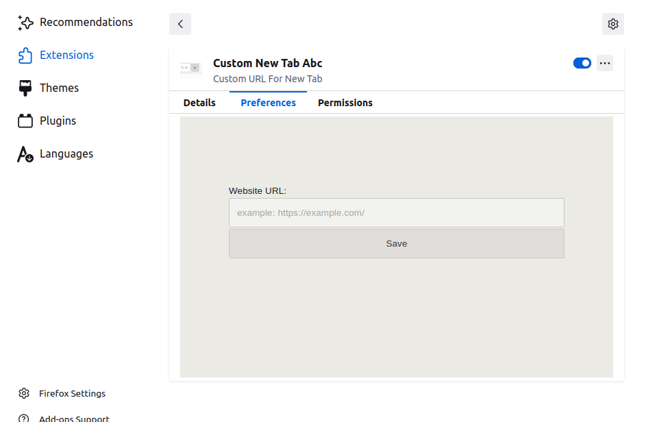
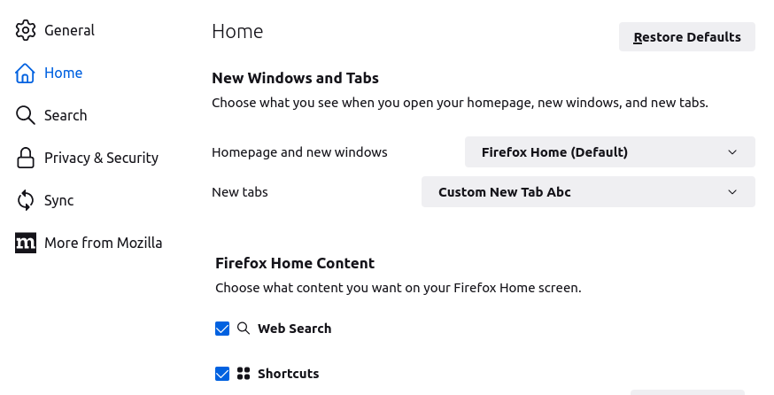

README.md

### custom new tab for Firefox browser
### about: custom url, sync, focus on page
### main code:
<!-- code -->
```javascript
// second 2 redirect
//https://developer.mozilla.org/docs/Mozilla/Add-ons/WebExtensions/Add_a_button_to_the_toolbar
browser.tabs.create({
url: rUrl
});
window.close();
}
//rUrl - redirect url
```

#### Screenshots:





