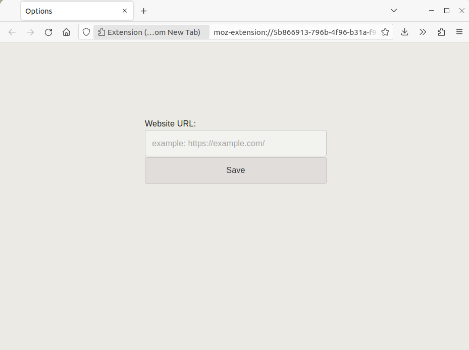
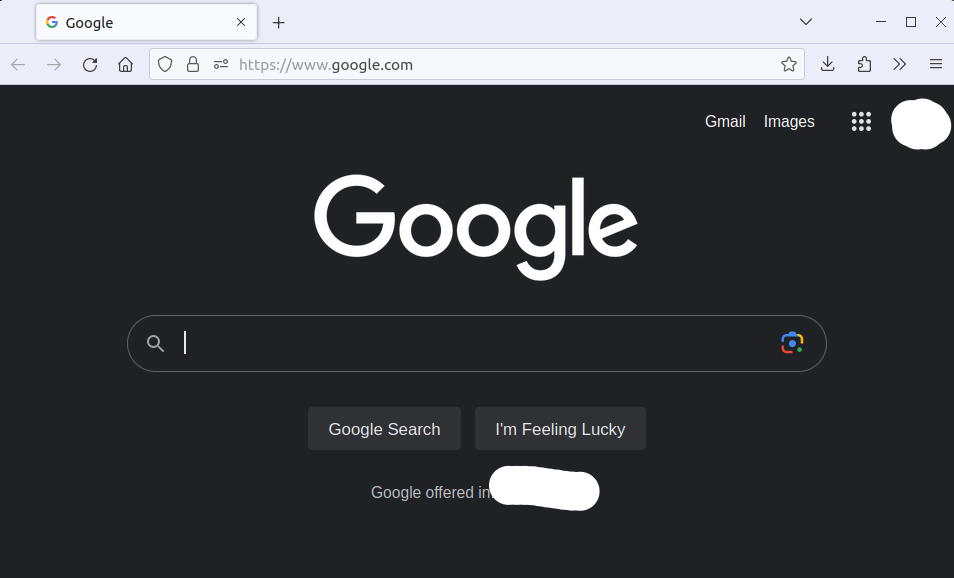
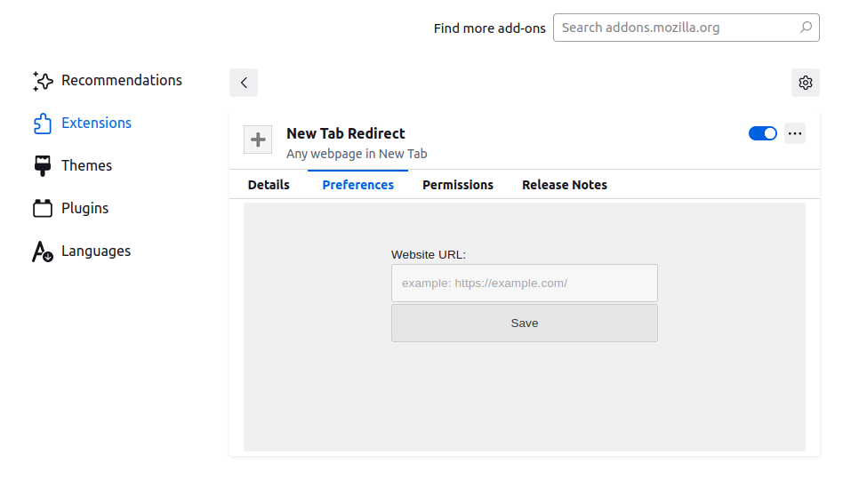

README.md

About:

Your own URL website will open in a New Tab.

You need to enter your website URL address in the addon options, then this address will be opened every time when you press the "+" button for create New Tab (or Ctrl+T)


Notice:

· Makes a small delay  

 ·How it works: when you open a new tab, the extension tab creates a new tab with your website address and closes the current one (redirect)  

· Broken functionality: when selected "Bookmarks Toolbar -> Only Show on New Tab" that not showing, because opened extension in new tab make redirect (creating a new tab) and immediately closed. One solution: Bookmarks Toolbar -> Always Show.  

· main code:
<!-- code -->
```javascript
// second 2 redirect
//https://developer.mozilla.org/docs/Mozilla/Add-ons/WebExtensions/Add_a_button_to_the_toolbar
browser.tabs.create({
url: rUrl
});
window.close();
//rUrl - redirect url
```

Screenshots:





